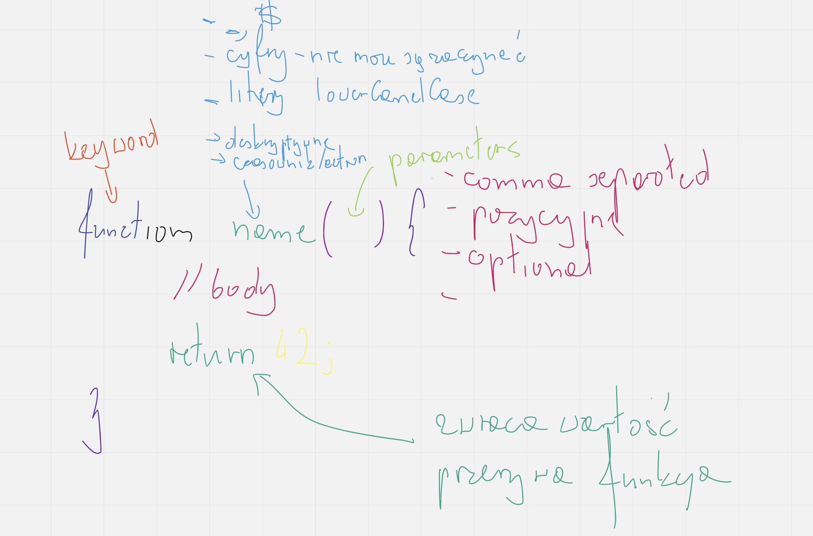

# Functions:
- named
- anonymous:
    - classic
    - arrow functions
  
---
Funkcje dają nam reużywalność kodu. Czyli blok kodu, który chcemy wywołać po identyfikatorze, można go sparametryzować i zwrócić wartość.

## Named functions

```js

function name(arg1, arg2) {
    // body function
    return 42
}

name(1, 2);

```



## Anonymous Functions
### Classic anonymous functions

```js

// function expression
const calculateResult = function() {
    // body
    return 42
}

body.document.addEventListener('click', function(){});

[1, 2, 3].map(function(item, id, array){
    return 42;
})

```

### Arrow functions

```js

const calculateResult = () => {
    return 42;
}

body.document.addEventListener('click', () => {});

[1, 2, 3].map((item, id, array) => {
    return 42;
})


// examples

function add(a, b) {
    return a + b;
}

const add1 = function (a, b) {
    return a + b;
}

const add2 = (a, b) => {
    return a + b;
}

const add3 = (a, b) => a + b; // expression

const add4 = a => a + 42; // działa, bad practice
const add5 = () => 42;

const magic = a => 0 <= a; // zwraca wynik warunku
const magic = a => 0 >= a; // zwraca wynik warunku

const magic2 = a => a => 0; // zwraca funkcje, zamiast warunku
const magic3 = (a) => {
    return 0 <= a;
}

const  magic4 = () => {
    return {
        a: 42
    }
}

const magic5 = () => ({a: 42});

```


